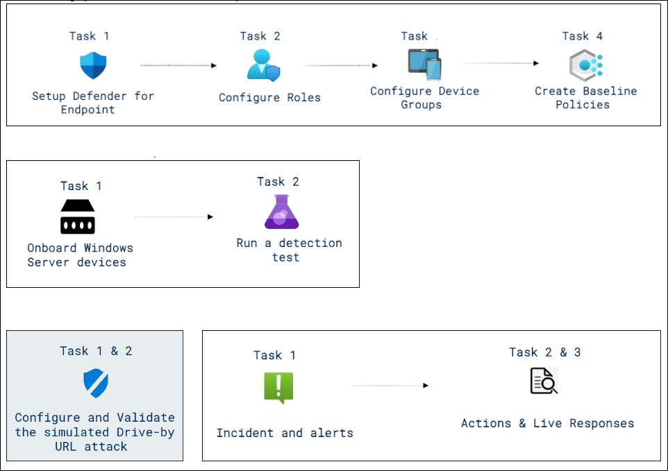
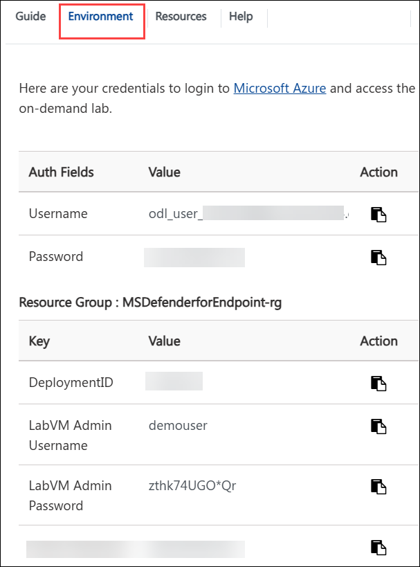

# Day 01 & 02: Streamline Management and Safegaurd endpoints

### Overall Estimated Duration: 72 Hours

## Overview

Microsoft Defender for Endpoint is an advanced security solution designed to help organizations safeguard their endpoints, including desktops, laptops, and servers, against sophisticated cyber threats. Previously named Microsoft Defender Advanced Threat Protection (ATP), this service is part of the Microsoft Defender suite and offers powerful features such as endpoint detection and response (EDR), threat intelligence, and vulnerability management. 

## Objective

By the end of this lab, you will be able to:

- **Setting up the Microsoft Defender for Endpoint Environment** : This hands-on exercise aims to implement and manage Microsoft Defender for Endpoint, strengthening endpoint security and aligning security policies with organizational standards.

- **Endpoint Onboarding - Conducting a PowerShell Detection Test with Microsoft Defender for Endpoint** : This hands-on exercise aims to onboard Windows Server devices to Microsoft Defender for Endpoint, verified device compliance with security policies, and conducted detection tests to confirm threat response capabilities, gaining hands-on experience in device onboarding, policy enforcement, and endpoint threat detection. 

- **Endpoint Security and Attack Detection using Defender for Endpoint** : This hands-on exercise participants gained hands-on experience in simulating and investigating Drive-by URL attacks, enhancing their understanding of attack techniques and improving their organization's cybersecurity posture using Microsoft Defender tools.

- **Microsoft Defender for Endpoint Incidents Management and Analysis** : This hands-on exercise participants gained practical skills in incident management, threat investigation, and real-time remediation using Microsoft 365 Defender, enhancing their ability to respond to security incidents effectively.
  
## Pre-requisites

- Familiarity with Microsoft 365 Defender and its components.
- Understanding of cybersecurity principles and attack methodologies.
- Access to a Microsoft 365 tenant with appropriate licenses.

## Architecture

The architecture diagram outlines a sequence of labs for implementing and configuring Microsoft Defender for Endpoint. Starting with setup and role configuration, users will configure device groups and create baseline policies. Subsequent labs focus on onboarding machines, managing vulnerabilities, configuring endpoint detection and response (EDR), testing endpoint capabilities, and simulating attack scenarios for hands-on security training.

## Architecture Diagram

## Explanation of Components

- **Azure Portal** : It is a web-based interface provided by Microsoft for managing and monitoring Azure resources and services. It serves as a central hub for users to create, configure, and manage their Azure resources, applications, and services.

- **Microsoft Defender Portal** : It is a security management platform that integrates various security solutions within the Microsoft ecosystem, enabling organizations to protect their environments across Microsoft 365, Azure, and other platforms. 

- **Microsoft Purview Portal** It is a unified platform designed for data governance, compliance, and risk management within Microsoft 365 and other Microsoft services. It provides organizations with the tools to manage and protect their data assets while ensuring compliance with various regulations.

- **Setup Defender for Endpoint**: Initiating Microsoft Defender for Endpoint, a cloud-powered endpoint security solution that detects, investigates, and responds to advanced threats.

- **Onboard Windows Server Devices**: Adding Windows Server devices to Microsoft Defender for Endpoint for centralized monitoring and threat detection.

- **Run a Detection Test**: Performing a simulated threat detection test to validate the Defender for Endpoint configuration and ensure it can effectively identify security threats.

- **Incident and Alerts**: Managing and responding to security incidents and alerts generated by Defender for Endpoint. Incidents are collections of related alerts that signal potential threats.

- **Actions & Live Responses**: Initiating actions such as isolating compromised devices, collecting forensic data, or taking live responses (e.g., real-time analysis and remediation).

- **Configure and Validate the Simulated Drive-by URL Attack**: Setting up a simulated drive-by download attack to assess the response of Defender for Endpoint. This test helps validate that the system can detect and block such web-based attacks effectively.

## Getting Started with the Lab

Ensure you have access to all required tools, account and carefully read each task and follow the steps in sequence. Refer to screenshots and tips provided for guidance throughout the lab.

## Accessing Your Lab Environment
 
Once you're ready to dive in, your virtual machine and lab guide will be right at your fingertips within your web browser.

   

## Virtual Machine & Lab Guide
 
Your virtual machine is your workhorse throughout the workshop. The lab guide is your roadmap to success.
 
## Exploring Your Lab Resources
 
To get a better understanding of your lab resources and credentials, navigate to the **Environment** tab.
 
   
 
## Utilizing the Split Window Feature
 
For convenience, you can open the lab guide in a separate window by selecting the **Split Window** button from the Top right corner.
 
 
 
## Managing Your Virtual Machine
 
Feel free to start, stop, or restart your virtual machine as needed from the **Resources** tab. Your experience is in your hands!
 

## Lab Validation

1. After completing the task, hit the **Validate** button under Validation tab integrated within your lab guide. If you receive a success message, you can proceed to the next task, if not, carefully read the error message and retry the step, following the instructions in the lab guide.

   
   
1. Click **"Next"** from the bottom right corner to embark on your Lab journey!

   

## Support Contact

The CloudLabs support team is available 24/7, 365 days a year, via email and live chat to ensure seamless assistance at any time. We offer dedicated support channels tailored specifically for both learners and instructors, ensuring that all your needs are promptly and efficiently addressed.

Learner Support Contacts:

- Email Support: cloudlabs-support@spektrasystems.com
- Live Chat Support: https://cloudlabs.ai/labs-support

Now, click on Next from the lower right corner to move on to the next page.

## Happy Learning!!

