# Lab 1 - Setting up the Microsoft Defender for Endpoint Environment

## Lab overview

In this lab, participants will immerse themselves in the practical implementation of Microsoft Defender for Endpoint. The primary goal is to equip participants with the skills and knowledge necessary to fortify the security infrastructure of organizational endpoints.

## Lab objectives

In this lab, you will perform the following:

- Task 1: Setup Defender for Endpoint  
- Task 2: Configure Roles
- Task 3: Configure Device Groups
- Task 4: Create Baseline Policies

## Task 1: Setup Defender for Endpoint  

In this task, you will perform the initialization of the Microsoft Defender for the Endpoint portal.

1. Inside the Lab-VM, double click on the  **Microsoft Edge** shortcut.

    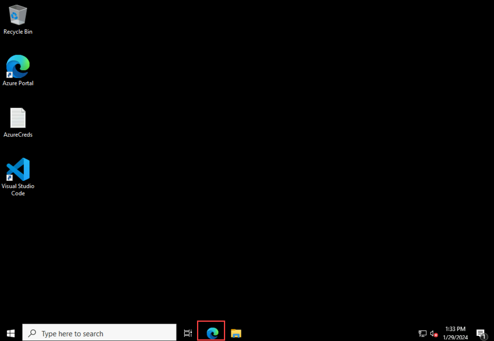

1. In the Edge browser, go to the [https://security.microsoft.com](https://security.microsoft.com).

1. In the **Sign in** dialog box, copy and paste **Email/Username: <inject key="AzureAdUserEmail"></inject>** and then select Next.

1. In the **Enter password** dialog box, copy and paste **Password: <inject key="AzureAdUserPassword"></inject>** and then select **Sign in**.

1. In the Action Required tab, select **Ask later** and then in the Stay signed in tab, select **No**.

1. On the **Microsoft Defender** portal, from the left-navigation menu. Expand **Investigation & response** and select **Incidents & alerts** >  **Email & collaboration alerts**.

    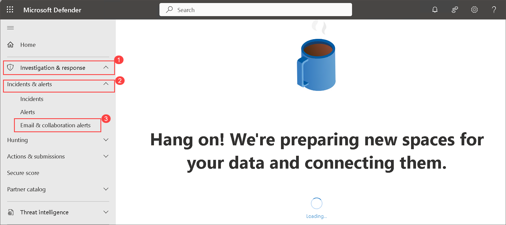

    >**Note:** If you do not see the options, please wait for 10-15 minutes to reflect the options.

1. In the new tab, open [https://compliance.microsoft.com](https://compliance.microsoft.com)

1. On the **Micosoft Purview Compliance Portal**, from the left-navigation menu, select **Settings(1)** and then click on **Device Onboarding(2)** to expand it, Next Click on **Devices(3)**. In devices, select **Turn on device onboarding in Devices (4)**.

    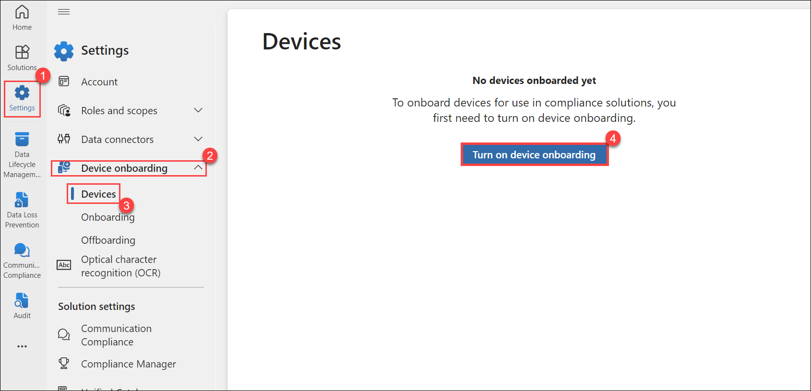

1. In the Turn on device Onboarding tab click on **OK**.

    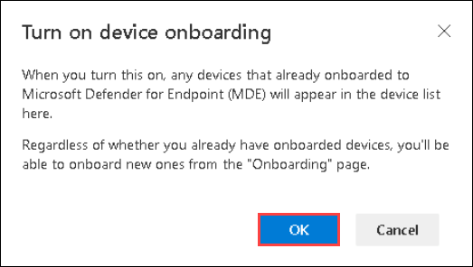

1. If the Device monitoring is being turned on then click on **OK**.

    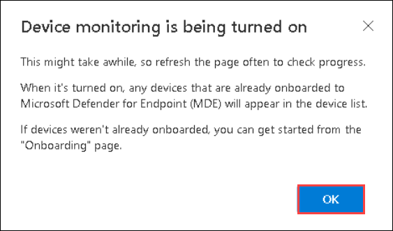

## Task 2: Configure Roles

In this task, you will configure roles for use with device groups.

1. Open a new tab, and browse to the [https://portal.azure.com](https://portal.azure.com).

1. In the **Sign in** dialog box, copy and paste **Email/Username (1)**: <inject key="AzureAdUserEmail"></inject> and then select **Next (2)**.

    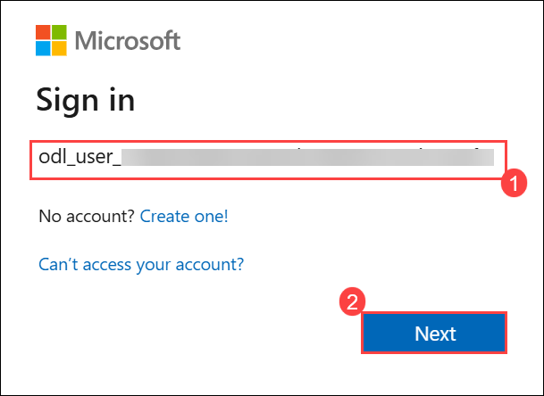

1. In the **Enter password** dialog box, copy and paste **Password (1)**: <inject key="AzureAdUserPassword"></inject> and then select **Sign in (2)**.

    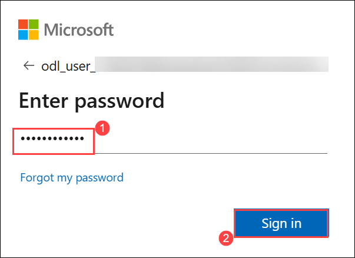

1. On the **Stay signed in?** dialog box, select the Don’t show this again check box and then select **No**.

    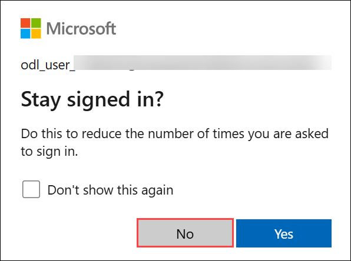

1. If a **Welcome to Microsoft Azure** popup window appears, click **Cancel** to skip the tour.

1. In the Azure portal, in the **Search resources, services, and docs** text box at the top of the Azure portal page, type **Microsoft Entra ID (1)**, and then select **Microsoft Entra ID (2)**.

    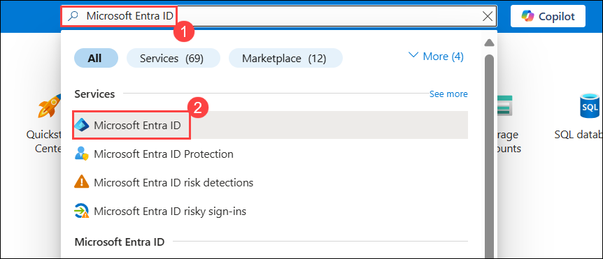

1. Under **Manage** section, select **Groups (1)** and then click on **New group (2)**.

    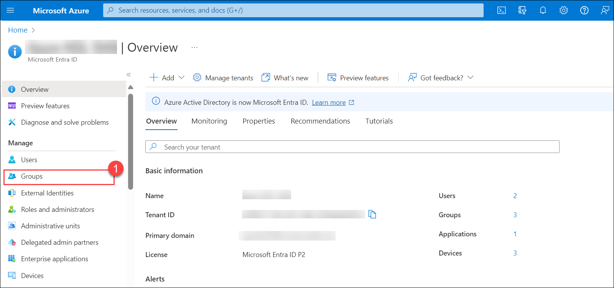

    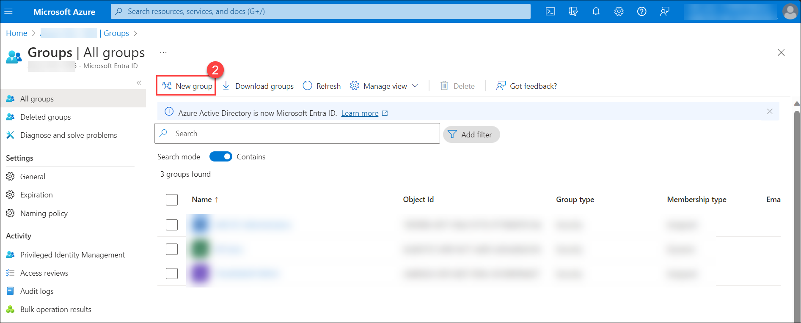
    
1. Enter the below details for the New group page:

   |Setting|Value|
    |---|---|
    |Group Type| **Microsoft 365 (1)** |
    |Group Name| **Sg-IT (2)** |
    |Microsoft Entra roles can be assigned to the group| **Yes (3)** |

1. Under **Owners** section, click on **No owners selected (4)** and select the **ODL_User <inject key="DeploymentID" enableCopy="false"></inject>** from the list and then click on **select**.

1. Under **Members** section, click on **No members selected (5)** and select the **ODL_User <inject key="DeploymentID" enableCopy="false"></inject>** from the list and then click on **select**.

   **Note**: Make sure you have selected **Group type** as Microsoft 365.

1. Select **Create (6)** and click on **Yes (7)**. 

   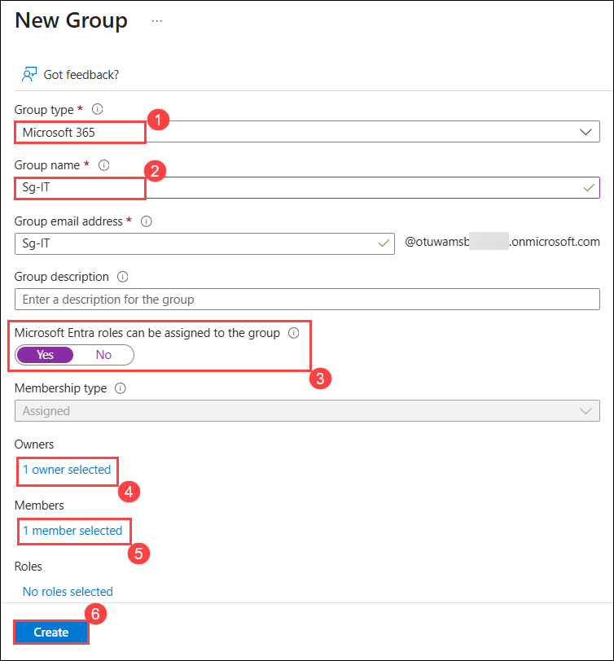

   

1. On the **Groups | All groups** page, if you are not able to see the group that you created, click **Refresh (2)** button.

    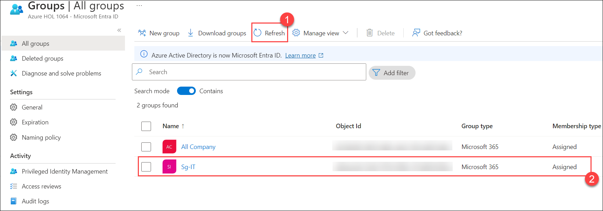

## Task 3: Configure Device Groups

In this task, you will configure device groups that allow for access control and automation configuration.

1. Navigate back to the **Microsoft Defender** portal tab. In the Microsoft Defender portal select **Settings (1)** from the left menu bar, then select **Endpoints (2)**. 

   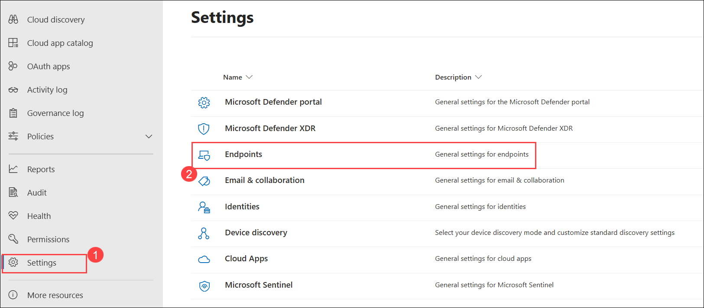

    >**Note:** If you do not see the **Endpoints** option, log out by selecting the top-right circle with your account initials and choose **Sign Out**. Open the page in private mode (InPrivate) and afterwards, log in again using the **Tenant Email** credentials or other options to consider are refreshing the page. It might take 10-15 minutes to reflect the option on portal. Try refreshing the page multiple times until the option appears.

1. Select **Device groups (2)** under the permissions area.

1. Select **+ Add device group (3)** icon.

        

1. Enter the following information on the General tab and select **Next (3)**.

      |General setting|Value|
      |---|---|
      |Device group name|**Regular (1)**|
      |Remediation level| **Full-remediate threats automatically (2)**|
 
    

1. On the **Devices** tab, for the OS condition select **Windows Server 2022 (1)** and select **Next (2)**.

   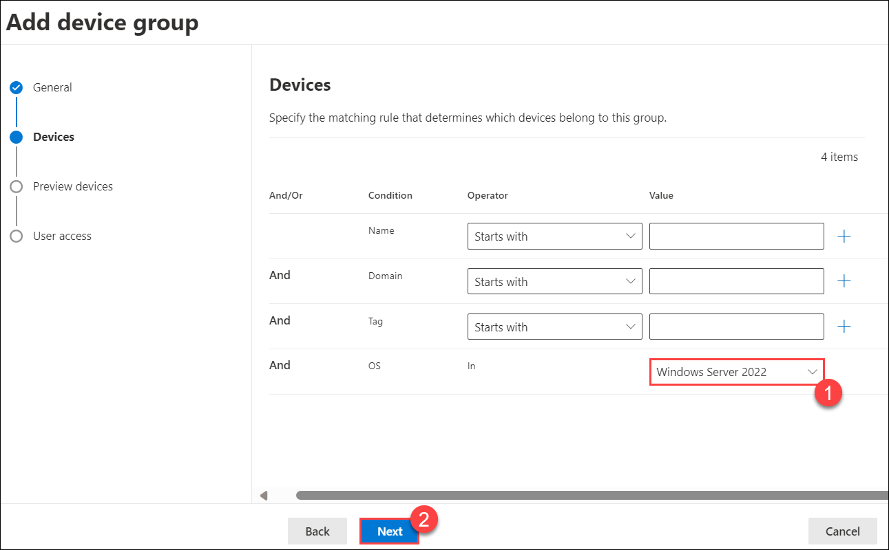

1. On the **Preview devices** tab, select **Next**.

1. On the User access tab, select **Sg-IT (1)** and then select **Add selected groups (2)** button. Make sure it appears under **Assigned Azure AD user groups**. Select **Submit (3)**

    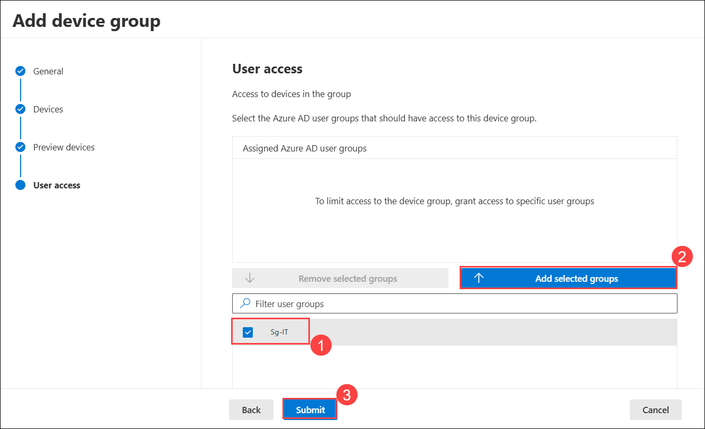

1. Select **Done**.

1. Device group configuration has changed. Select **Apply changes** to check matches and recalculate groupings.

    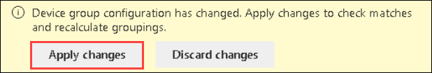

1. You are going to have two device groups now; the **Regular** you just created and the **Ungrouped devices (default)** with the same remediation level.
 
    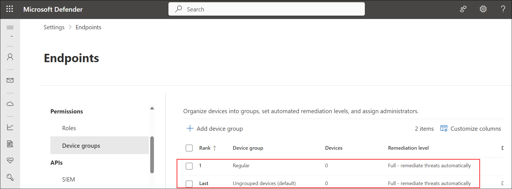

  ## Task 4: Create Baseline Policies

In this task, your objective is to implement the Windows Intune security baseline, which offers a comprehensive set of recommended settings essential for securely configuring devices running Windows. This includes configuring browser settings, PowerShell configurations, and specific settings for security features such as Microsoft Defender Antivirus.

1. Open another tab and browse to the https://intune.microsoft.com/. If prompted to sign in, sign in with the following credential:

    - **Email/Username: <inject key="AzureAdUserEmail"></inject>**
    
    - **Password: <inject key="AzureAdUserPassword"></inject>**

1. From the left navigation pane, select **Endpoint security (1)**, under **Overview** section, select **Security baselines (2)**. then click on **Security Baseline for Windows 10 and later (3)**.

   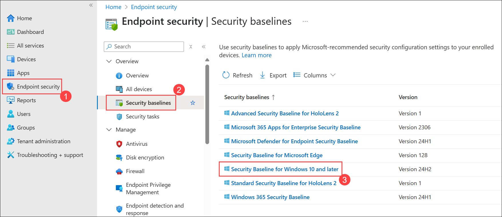

1. On the **Security Baseline for Windows 10 and later | Profiles** page, select **+ Create policy**.

   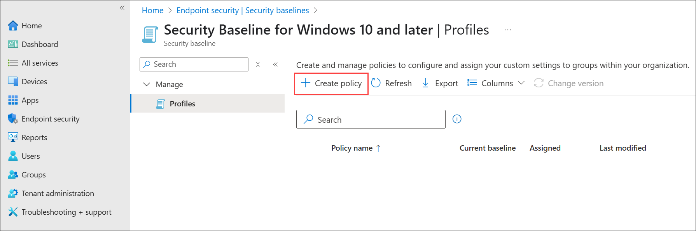

1. On the **Create a profile**, review the **Platform** and **Profile** default settings, then select **Create**.

   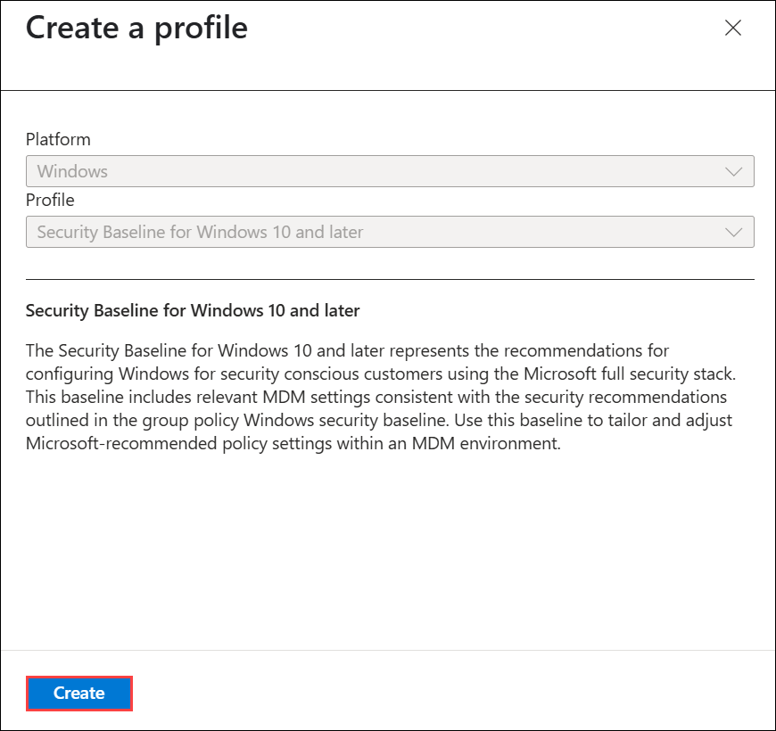

1. On the **Create profile** page, under the **Basics** tab, enter any name **MDM-policy (1)** of your choice and **description (optional)**, then select **Next (2)**.

   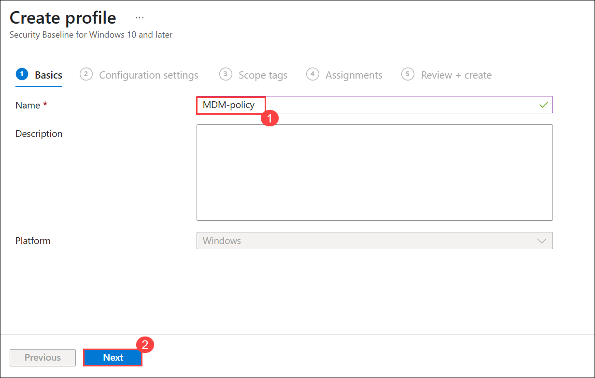

1. On the **Configuration settings** tab, review all configurations by expanding each one. If you want to edit any of the configurations, feel free to make your changes. Select **Next**.

1. Keep the **Scope tags** tab as default, select **Next**.

1. On the **Assignments** tab, under **Included groups**, select **Add groups (1)**. On the **Select groups to include** page, choose **Sg-IT (2)**, and click on **Select (3)**. Back on the Assignments tab, verify that the Sg-IT is selected and click **Next**.

   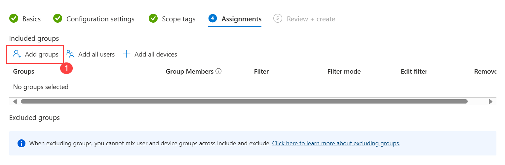

   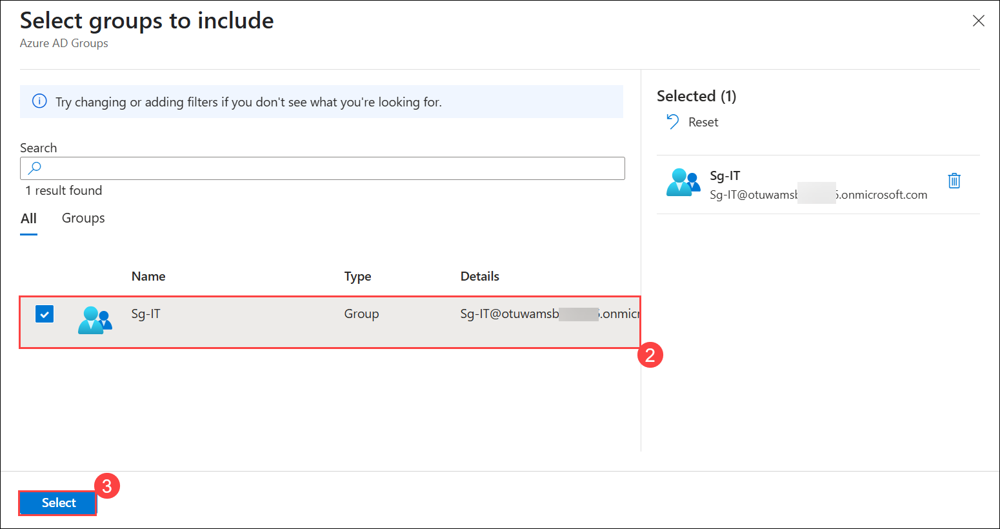

1. Select **Create**.

1. After the policy is created, you will be able to view it in the **MDM Security Baseline | Profiles** section.

     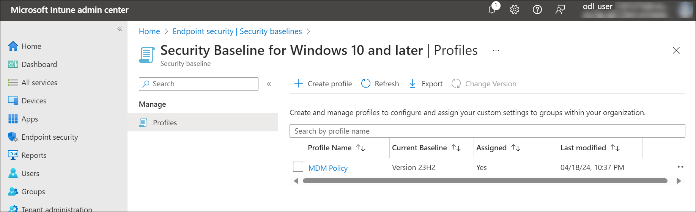

1. Close the **Microsoft Intune admin center** portal.

> **Congratulations** on completing the task! Now, it's time to validate it. Here are the steps:.
> - Hit the Validate button for the corresponding task. If you receive a success message, you can proceed to the next task. 
> - If not, carefully read the error message and retry the step, following the instructions in the lab guide.
> - If you need any assistance, please contact us at cloudlabs-support@spektrasystems.com. We are available 24/7 to help you out.
   
<validation step="55092f48-1e55-4402-9a71-887f7c82c36b" />  

## Summary

In this lab, you have completed the following:

- Set up and configure Microsoft Defender for Endpoint, including onboarding devices, creating device groups, and assigning security roles.

- Applied security baselines via Microsoft Intune to enforce recommended security settings on Windows devices.

## Click Next to continue to the next lab.
