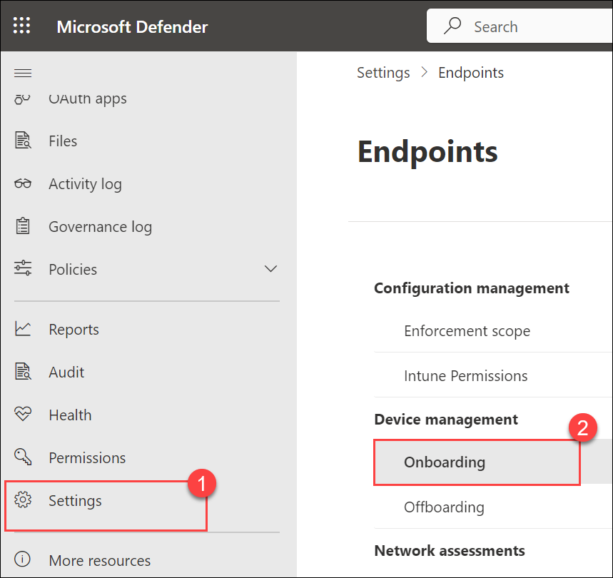
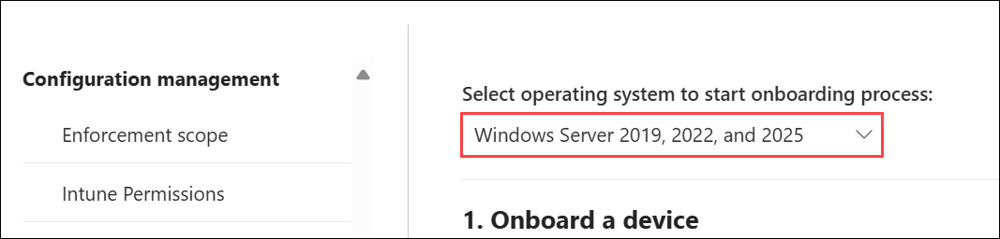
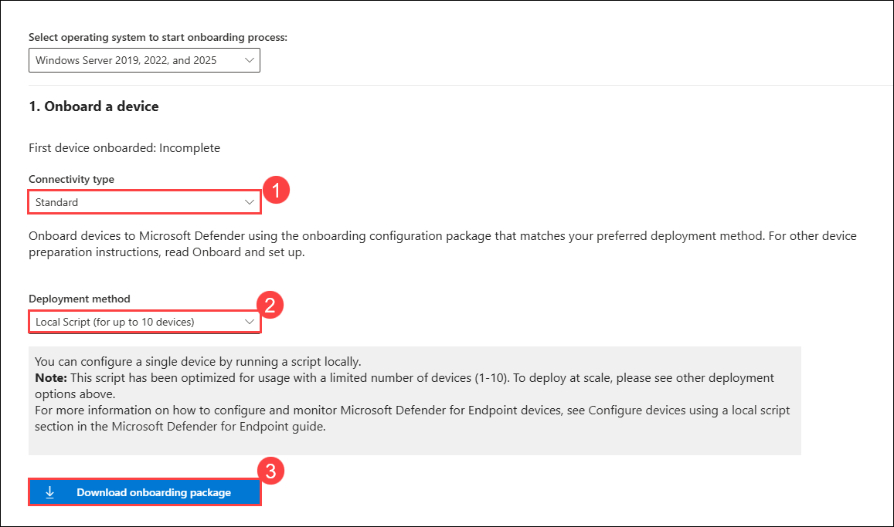
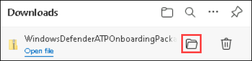
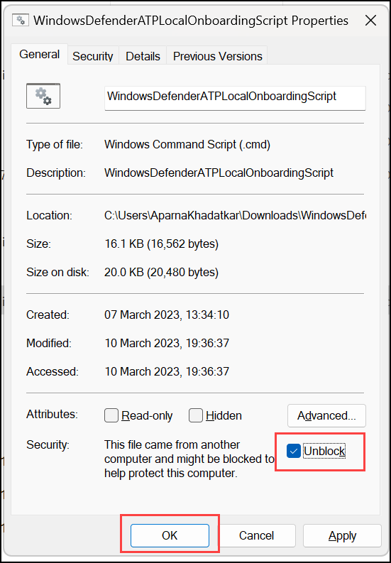
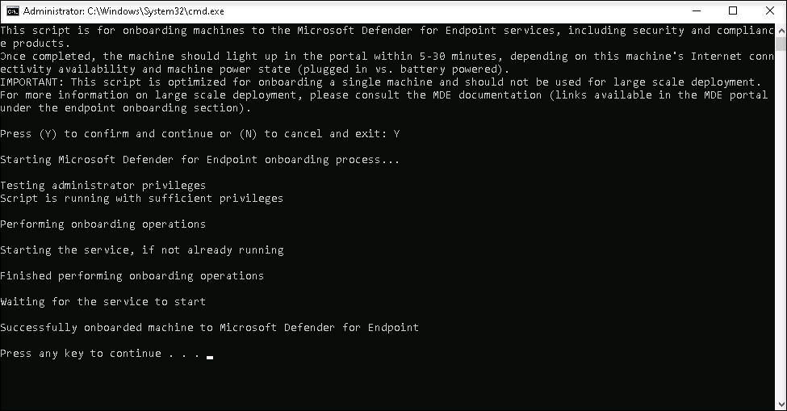
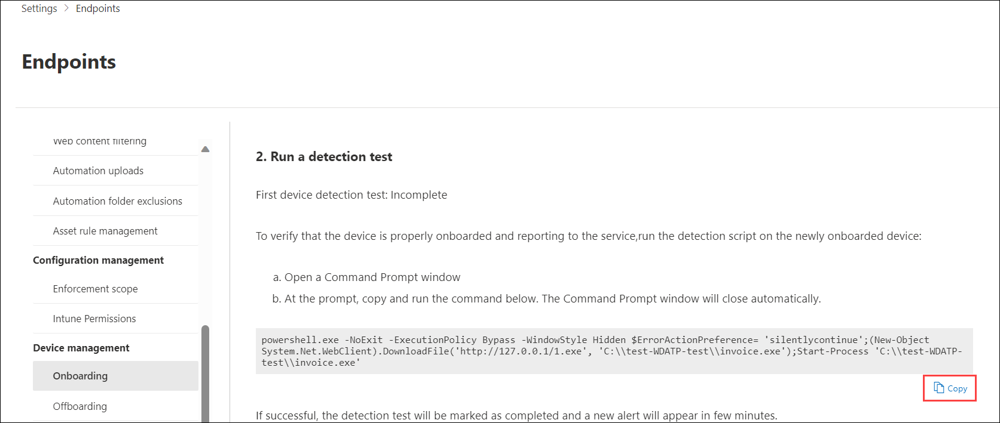
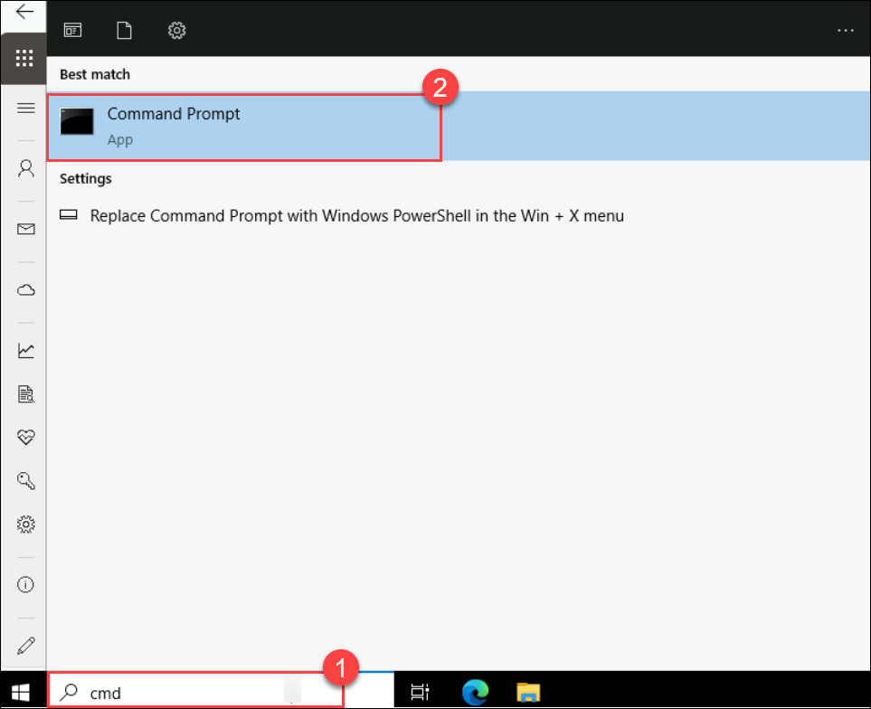
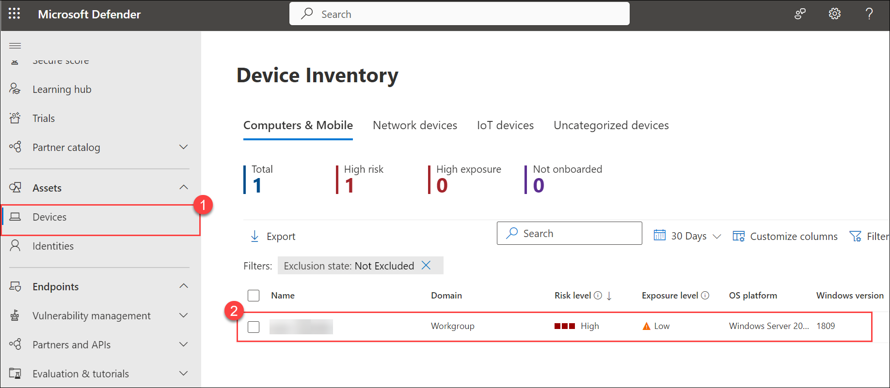
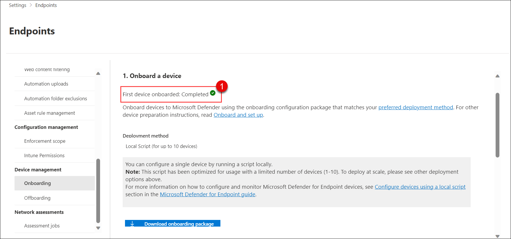

# Lab 2 - Validating Endpoint Onboarding - Conducting a PowerShell Detection Test with Microsoft Defender for Endpoint

## Lab overview

Microsoft Defender for Endpoint and running detection tests to assess the responsiveness of the security service. Participants will actively engage in setting up and configuring Defender for Endpoint, understanding how to seamlessly integrate devices and evaluate their effectiveness in threat detection scenarios.

## Lab objectives

In this lab, you will perform the following:

- Task 1: Onboard Windows Server devices 
- Task 2: Run a detection test

### Task 1: Onboard Windows server devices

In this task, you will onboard Windows server devices to Microsoft Defender for Endpoint using an onboarding script.

1. Navigate back to the Microsoft Defender portal in your browser, or if the tab was closed, go to https://security.microsoft.com and sign in with the **Tenant Email** credentials.

1. Select **Settings (1)** from the left menu bar, then from the Settings page, select **Endpoints**.

   >**Note:** This is an anticipated delay in the Microsoft Defender portal, which sometimes takes longer than expected to display the Endpoints.

1. Select **Onboarding (2)** under the Device Management section.

    >**Note:** You can also perform device onboarding from the **Assets** section of the left menu bar. Expand Assets and select Devices. On the Device Inventory page, with Computers & Mobile selected, scroll down to **Onboard devices.** This takes you to the **Settings > Endpoints** page.

   

1. From the drop-down of **Select operating system to start onboarding process**, select **Windows Server 2019,2022, and 2025**.

   

1. In the "**1. Onboard a device**" area make sure under the connectivity type Select **Standard (1)** and  "**Local Script (for up to 10 devices) (2)**" is displayed in the Deployment method drop-down and select the **Download onboarding package (3)** button. 

   

1. Under the *Downloads* pop-up, highlight the "**WindowsDefenderATPOnboardingPackage.zip**" file with your mouse and select the folder icon **Show in folder**. 

    >**Hint:** In case you don't see it, the file should be in the c:\users\admin\downloads directory.
    
   

1. Right-click the downloaded zip file and select **Extract All...**, make sure that **Show extracted files when complete** is checked and select **Extract**.

1. Right-click on the extracted file "WindowsDefenderATPLocalOnboardingScript.cmd" and select **Properties**. Select the **Unblock** checkbox in the bottom right of the Properties windows and select **OK**.

   

1. Right-click on the extracted file **WindowsDefenderATPLocalOnboardingScript.cmd** again and choose **Run as Administrator**.  

    >**Hint:** If you encounter the Windows SmartScreen window, select on **More info**, and choose **Run anyway**. 

    >**Note:**  When the "User Account Control" window is shown, select **Yes** to allow the script to run.
    
1. Type **Y** to the question presented by the script and press **Enter**. When complete you should see a message in the command screen that says *Successfully onboarded machine to Microsoft Defender for Endpoint*.

1. Press any key to continue. This will close the Command Prompt window.

   

### Task 2: Run a detection test

In this task, run the following PowerShell script on a newly onboarded device to verify that it's properly reporting to the Defender for Endpoint service.

1. Back in the Onboarding page from the Microsoft Defender portal, under the section "**2. Run a detection test**", copy the detection test script by selecting the **Copy** button.  

   

1. Inside the Lab-VM, on the **Type here to search**, and search for **CMD (1)**, right-click on **Command Prompt (2)** and select **Run as administrator**.

   

1. Paste the script by right-clicking in the **Administrator: Command Prompt** windows and press **Enter** to run it. 

    >**Note:** The window closes automatically after running the script.

1. Open the Microsoft Defender portal. In the left-hand menu, under the **Assets** area, select **Devices (1)**. You can see the device that is onboarded. If the device is not visible, repeat Task 1 - Steps 9 and 10 two to three times. It can take up to 15 minutes for the devices to appear under Assets.

   

    >**Note:** If you have completed the onboarding process and don't see devices in the Devices list after an hour, it might indicate an onboarding or connectivity problem.

    >**Note:** Before, proceeding to next lab select **Settings** from the left menu bar, then from the settings page, select **Endpoints**, Select **Onboarding** under 
     the Device Management section and make sure **First device onboarded is Completed**.
    
     

> **Congratulations** on completing the task! Now, it's time to validate it. Here are the steps:.
> - Hit the Validate button for the corresponding task. If you receive a success message, you can proceed to the next task. 
> - If not, carefully read the error message and retry the step, following the instructions in the lab guide.
> - If you need any assistance, please contact us at cloudlabs-support@spektrasystems.com. We are available 24/7 to help you out.
   
<validation step="f6505f87-21bb-4244-bc05-048c8875d90e" />

## Summary

In this lab, you have completed the following:

- Onboarded Windows Server devices to Microsoft Defender for Endpoint using a local onboarding script.
- Performed a detection test to verify device connectivity and Defender threat detection capability.

## Click Next to continue to the next lab.
