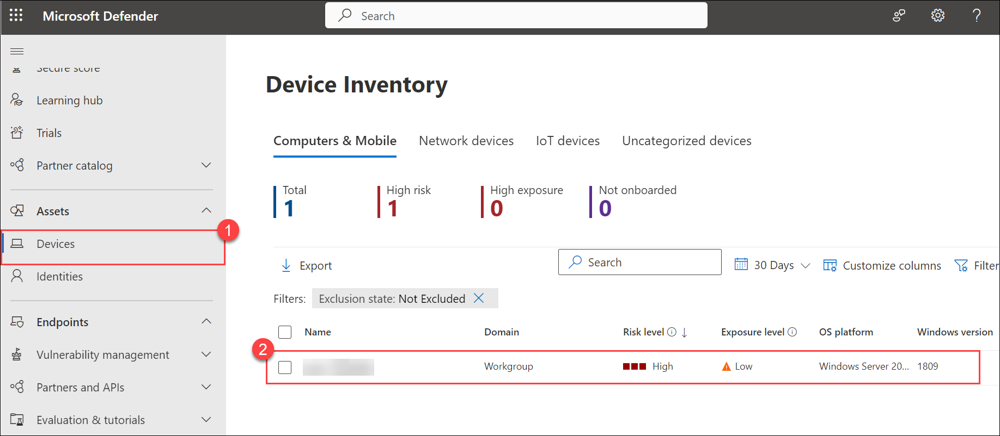

# Lab 4 - Microsoft Defender for Endpoint Incidents Management and Analysis

## Lab overview

This lab encompasses the end-to-end process of incident detection, alert generation, response actions, and live responses within an EDR framework. Participants will gain hands-on experience in managing security incidents from detection to resolution, utilizing the live response feature for real-time remediation.

## Lab objectives

In this lab, you will perform the following:

- Task 1: Explore Incident and Alerts
- Task 2: Investigate Incidents & Alerts (Actions)
- Task 3: Live Responses

### Task 1: Explore Incident and Alerts

In this task, you will run two simulated attacks to explore the capabilities of Microsoft Defender for Endpoint.

1. If the Microsoft 365 Defender portal is not open in your Microsoft Edge browser, open a new tab and go to (https://security.microsoft.com).

1. In the **Sign in** dialog box, copy and paste Email/Username: <inject key="AzureAdUserEmail"></inject> and then select Next.

1. In the **Enter password** dialog box, copy and paste Password: <inject key="AzureAdUserPassword"></inject> and then select **Sign in**.

1. Open the Microsoft 365 Defender portal select **Incidents & alerts** from the left menu bar, then select **Incidents**.

    

1. Select the new incident named "**Execution incident on one endpoint**" to load its details.

   

   >**Note:** If you are unable to see the incident, open **Command Prompt** as an administrator and run the command below **2 to 3 times**:

   ```
   powershell.exe -NoExit -ExecutionPolicy Bypass -WindowStyle Hidden $ErrorActionPreference= 'silentlycontinue';(New-Object System.Net.WebClient).DownloadFile('http://127.0.0.1/1.exe', 'C:\\test-WDATP-test\\invoice.exe');Start-Process 'C:\\test-WDATP-test\\invoice.exe'
   ```
    >**Note:** Select **Close** on the **Execution incident on one endpoint**.

1. From the left menu bar, choose **Incidents & Alerts (1)**, then click on **Alerts (2)** to view all generated alerts. You can select any of the alerts to check the details.

   
    
### Task 2: Investigate Incidents & Alerts (Actions)

When you investigate an incident, you'll see:

- Incident details
- Incident comments and actions
- Tabs (attack story, alerts, assets, investigations, evidence & response, summary)

1. Navigate back to the **Incidents** page, by selecting **Incidents**, under **Incidents & alerts**.

2. Select the new incident named "**Execution incident on one endpoint**" to load its details. This opens the main page for the incident where you'll find the full attack story information and tabs for alerts, devices, users, investigations, and evidence. 

     

    >**Note:** Select **Close** on the **Execution incident on one endpoint**. 

3. Here are the detailed information on the tabs:

    - **Attack story**:- 

    - Attack stories help you to quickly review, investigate, and remediate attacks while viewing the full story of the attack on the same tab. It also allows you to review the entity details and take remediation actions, such as deleting a file or isolating a device without losing context. Within the attack story you can find the alert page and the incident graph. The incident alert page has these sections:- Alert story, which includes: What happened, Actions taken, Related events, and Alert properties in the right pane (state, details, description, and others).
    
      >**Note:** Note that not every alert will have all of the listed subsections in the Alert story section.

         

    - **Alert**:- 

    - On the Alerts tab, you can view the alert queue for alerts related to the incident and other information about them such as:

        - Severity.
        - The entities that were involved in the alert.
        - The source of the alerts (Microsoft Defender for Identity, Microsoft Defender for Endpoint, Microsoft Defender for Office 365, Defender for Cloud Apps, and the app governance add-on).
        - The reason they were linked together.

           

        - For example, By default, the alerts are ordered chronologically to allow you to see how the attack played out over time. When you select an alert within an incident, Microsoft Defender displays the alert information specific to the context of the overall incident. You can see the events of the alert, which other triggered alerts caused the current alert, and all the affected entities and activities involved in the attack, including devices, files, users, and mailboxes.

              

    - **Assets**:- 

        - Easily view and manage all your assets in one place with the new **Assets** tab. This unified view includes Devices, Users, Mailboxes and Apps.

        - The Assets tab displays the total number of assets beside its name. A list of different categories with the number of assets within that category is presented when selecting the Assets tab.

             

    - **Devices**:- 

        - The **Devices** view lists all the devices related to the incident. Here's an example.
                
            
            
        - Selecting a device from the list opens a bar that allows you to manage the selected device. You can quickly export, manage tags, initiate automated investigations, and more.

        - Select the name of the device to see device details in the Defender for Endpoint device inventory. From the device page, you can gather additional information about the device, such as all of its alerts, a timeline, and security recommendations. For example, from the Timeline tab, you can scroll through the device timeline and view all events and behaviors observed on the machine in chronological order, interspersed with the alerts raised. Here's an example

            

            >**Note:** Go back to the **Assets** tab page.
        
    - **Users**:- 
            
        - The Users view lists all the users that have been identified to be part of or related to the incident. Here's an example.

             

        - You can select the check mark for a user to see details of the user account threat, exposure, and contact information. Select the user name to see additional user account details.

    - **Mailboxes**:- 

        - The Mailboxes view lists all the mailboxes that have been identified to be part of or related to the incident.

    - **Apps**:- 

        - The Apps view lists all the apps identified to be part of or related to the incident. Here's an example.

    - **Investigations**:- 

    - The **Investigations** tab lists all the automated investigations triggered by alerts in this incident. Automated investigations will perform remediation actions or wait for analyst approval of actions, depending on how you configured your automated investigations to run in Defender for Endpoint and Defender for Office 365

        >**Note:** Investigations may not be visible or apparent.

        

    - Select an investigation to navigate to its details page for full information on the investigation and remediation status.

    - There is also an Investigation graph tab that shows:

        - The connection of alerts to the impacted assets in your organization.
        - Which entities are related to which alerts and how they are part of the story of the attack?
        - The alerts for the incident.

    - The investigation graph helps you quickly understand the full scope of the attack by connecting the different suspicious entities that are part of the attack with their related assets such as users, devices, and mailboxes.

        >**Note:** Go back to the **Investigations** tab, page.

    - **Evidence and Response**:- 

    - The Evidence and Response tab shows all the supported events and suspicious entities in the alerts in the incident. Here's an example.

          

    - Microsoft Defender automatically investigates all the incidents' supported events and suspicious entities in the alerts, providing you with information about important emails, files, processes, services, IP Addresses, and more. This helps you quickly detect and block potential threats in the incident.

    - Each of the analyzed entities is marked with a verdict (Malicious, Suspicious, Clean) and a remediation status. This helps you understand the remediation status of the entire incident and what next steps can be taken.

     

4. To continue the investigation, select the **Alerts** tab, and select any one alert. It will open detailed information about the alert.               

     

5. On the alert page, under **Alert story** select any item in the process tree to open the side pane, it contains details like execution and file details including the hash, size and signer. Scroll down to the side pane to understand the number of times this file has been seen worldwide and in the organization. 

6. Select **Open file page**, to drill into it and continue with the investigation. The file page provides incredible details about an executable file. 

   
7. The **Overview (1)** tab provides the same information as the file side pane did. 

    - The **Incidents & alerts (2)** tab goes on to show all the alerts associated with this file. 

    - The **Observed in Organization (3)** tab provides even more context. It lists the machine this file has been observed on, and you can even use the interactive timeline to scope it to a date range within the past six months. 

    - Last, if you're unsure whether the file is malicious, send it for **Deep analysis (4)**. Select **Submit**, it will submit the file to Microsoft Defender for Endpoint for detonation and observation, with detailed results provided in a report.

        >**Note:** If the file is malicious, select **Stop and Quarantine File**, it will display the pop-up of the **Stop and Quarantine File**, provide a comment and select **Confirm**.

8. Once, you are satisfied that you have dealt with the incident addressed the alerts linked to it and taken all required remediation actions, the step is to resolve it. To do that, select **Manage incident**

9. Navigate back to the **Incident** page, on the **Attack story** tab, select the alert which you were investigating, and select **Manage alert**.

     

10. On the **Manage alert** page, follow these instructions: select **Save**, and then close the alert page.
    
     |**Settings**|**Value**|
     |------------|---------|
     |Status|**Resolved**|
     |Assign to|**Assign to me**|
     |Classification|**Select according to your preference**|
     |Comment (Optional)|**Add a comment** as per your choice|

### Task 3: Live Responses

In this task, Live response is crafted to bolster investigations, empowering your security operations team to gather forensic data, execute scripts, forward suspicious entities for analysis, mitigate threats, and actively pursue emerging threats.

1. If you are not on the **Microsoft Defender** portal, open a new tab and go to (https://security.microsoft.com).

2. On the **Microsoft Defender** portal, from the left-navigation menu select **Settings**, on the **Settings** page, select **Endpoints**. 

3. Now, we will enable the **Live Response**, so that we can, run basic and advanced commands to do investigative work on a device. Download files such as malware samples and outcomes of PowerShell scripts. Download files in the background (new!).
Upload a PowerShell script or executable to the library and run it on a device from a tenant level.
Take or undo remediation actions.

4. On the **Endpoints** page, select **Advanced features (1)**, scroll down until you found the **Live Response** toggle. Now, follow these instructions, and choose **Save preferences (4)**:

    |**Settings**|**Value**|
    |------------|---------|
    |Live Response| **On (2)**|
    |Live Response for Servers|**On (3)**|

     

5. From the left navigation menu, under **Assets**, select **Devices (1)**, and select the device (2) that you are using to generate the alerts and the incidents.

    

6. On the **Device** page, select **More actions (...) (1)**, and select **Initiate Live Response Session (2)**.

    

    >**Note:** If the **Initiate Live Response** option is not visible, then try signing out and signing back in to the Microsoft Defender portal. After signing back in to the Microsoft Defender portal re-perform steps-5 to 6 and wait for few minutes for the option to populate.

    

7. When you initiate a live response session on a device, a dashboard opens. The dashboard provides information about the session such as the following:

   - Who created the session
   - When the session started
   - The duration of the session

       

8. Now run the following commands:

    ```PowerShell
    connect
    ```

    >**Note:** **Connect**:- It initiates a live response session to the device.

    ```PowerShell
    connections
    ```

    >**Note:** **Connections**:- Shows all the active connections.

    ```PowerShell
    processes
    ```

    >**Note:** **Processes**:- Shows all processes running on the device.

    ```PowerShell
    scheduledtasks
    ```

    >**Note:** **scheduledtasks**:- Shows all scheduled tasks on the device.

    ```PowerShell
    services
    ```

    >**Note:** **Services**:- Shows all services on the device.

    >**Note:** If you have any malware script or diagnostic script that you want to run and check using Live Response, you can do so by following these steps:

    - On the top of the page select **Upload file to library**.

       

    - Select **Upload file to library (1)**, selecṭ the **Malware script**, and any **Diagnostic script** **(2)** (Select any of the script file which is available in the C drive) to upload. Select **Submit**.

       

    - After uploading the script, run the following commands:

        ```PowerShell
        library
        ```

        ```PowerShell
        Run <Filename>
        ```

9. View the console help to learn about command parameters. To learn about an individual command, run:

     ```PowerShell
     help <command name>
     ```

     >**Note:** Replace **commandname** with the command for which you need help. 

10. Select the **Command log** tab to see the commands used on the device during a session. Each command is tracked with full details such as:

     - ID
     - Command line
     - Duration
     - Status and input or output side bar 

       

> **Congratulations** on completing the task! Now, it's time to validate it. Here are the steps:.
> - Hit the Validate button for the corresponding task. If you receive a success message, you can proceed to the next task. 
> - If not, carefully read the error message and retry the step, following the instructions in the lab guide.
> - If you need any assistance, please contact us at cloudlabs-support@spektrasystems.com. We are available 24/7 to help you out.

<validation step="92911dc0-fd28-49a5-8375-98f9589c6843" />

## Summary 

In this lab, you have completed the following:

- Explored incidents and alerts within Microsoft Defender for Endpoint, reviewing generated alerts, incident details, and attack stories.
- Performed investigation and response actions, including initiating Live Response sessions, running forensic commands, and managing remediation actions on compromised devices.

# You have successfully completed the lab.
