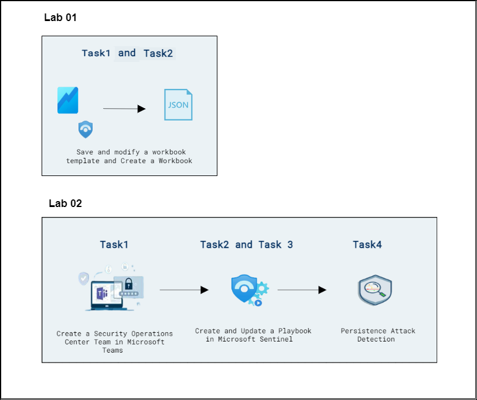
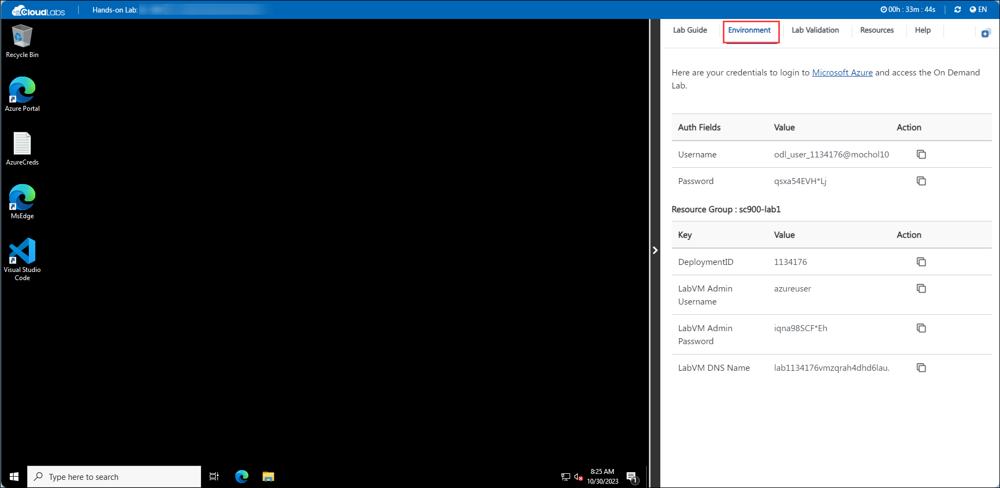

# Day 03: Onboarding and configuring Devices

### Overall Estimated Duration: 4 Hours

## Overview
Microsoft Sentinel allows you to create custom workbooks across your data and comes with built-in workbook templates to allow you to quickly gain insights across your data as soon as you connect a data source.icrosoft Sentinel allows you to create custom workbooks across your data and comes with built-in workbook templates to allow you to quickly gain insights across your data as soon as you connect a data source.

## Objective
By the end of this lab, participants will:  

- **Configure Sentinel Workbooks and Detection Rules**: utilize Microsoft Sentinel to enhance security monitoring by creating workbooks and connecting relevant data sources. You'll start by setting up a Sentinel workspace and integrating security event connectors.
  
- **Configure Detection Rules**: configuring detection rules in Microsoft Sentinel to identify and respond to potential security threats. You'll work with Log Analytics KQL queries to create custom analytics rules for detecting persistence and privilege elevation attacks. 

## Pre-requisites 
Participants should meet the following prerequisites:  

Here are 4-5 technical skills prerequisites for the "Configure Sentinel Workbooks and Detection Rules" labs:

1. **Microsoft Sentinel Setup and Configuration**: Familiarity with setting up and managing Microsoft Sentinel workspaces, including connecting data sources like Azure security logs and integrating third-party connectors.
   
1. **Azure Monitor Workbooks**: Understanding of Azure Monitor Workbooks and how to create custom dashboards and visualizations for security data in Microsoft Sentinel.

## Architecture 
In this hands-on lab, you will configure Microsoft Sentinel for security monitoring by setting up a workspace, and integrating Windows Security Event data. You'll also customize workbooks to visualize security data. Additionally, you'll create automated playbooks and configure detection rules for persistence and privilege escalation attacks.

## Architecture Diagram

  

## Explanation of Components 
The architecture for this lab involves the following key components:

#### Lab 01
- **Save and Modify a Workbook Template**: Customize and save a pre-existing workbook template to suit your security monitoring needs.
- **Create a Workbook**: Design and create a custom workbook for visualizing and analyzing security data in Microsoft Sentinel.

#### Lab 02
- **Playbook Creation**: Develop and configure automated playbooks in Microsoft Sentinel to orchestrate incident responses and remediation actions.
- **Persistence Attack Detection**: Set up detection rules to identify potential persistence mechanisms used by attackers to maintain access to systems.
- **Privilege Elevation Attack Detection**: Configure detection rules to recognize and alert on privilege escalation attempts that could compromise system security.

## Getting Started with the Lab

Ensure you have access to all required tools, account and carefully read each task and follow the steps in sequence. Refer to screenshots and tips provided for guidance throughout the lab.
 
## Accessing Your Lab Environment
 
Once you're ready to dive in, your virtual machine and lab guide will be right at your fingertips within your web browser.

   

## Virtual Machine & Lab Guide
 
Your virtual machine is your workhorse throughout the workshop. The lab guide is your roadmap to success.
 
## Exploring Your Lab Resources
 
To get a better understanding of your lab resources and credentials, navigate to the **Environment** tab.
 
   
 
## Utilizing the Split Window Feature
 
For convenience, you can open the lab guide in a separate window by selecting the **Split Window** button from the Top right corner.
 
 
 
## Managing Your Virtual Machine
 
Feel free to start, stop, or restart your virtual machine as needed from the **Resources** tab. Your experience is in your hands!
 

## Lab Validation

1. After completing the task, hit the **Validate** button under Validation tab integrated within your lab guide. If you receive a success message, you can proceed to the next task, if not, carefully read the error message and retry the step, following the instructions in the lab guide.

   

1. If you need any assistance, please contact us at cloudlabs-support@spektrasystems.com.

1. Click **"Next"** from the bottom right corner to embark on your Lab journey!

   .png)

## Support Contact

The CloudLabs support team is available 24/7, 365 days a year, via email and live chat to ensure seamless assistance at any time. We offer dedicated support channels tailored specifically for both learners and instructors, ensuring that all your needs are promptly and efficiently addressed.

Learner Support Contacts:

- Email Support: cloudlabs-support@spektrasystems.com
- Live Chat Support: https://cloudlabs.ai/labs-support

Now, click on Next from the lower right corner to move on to the next page.

## Happy Learning!!