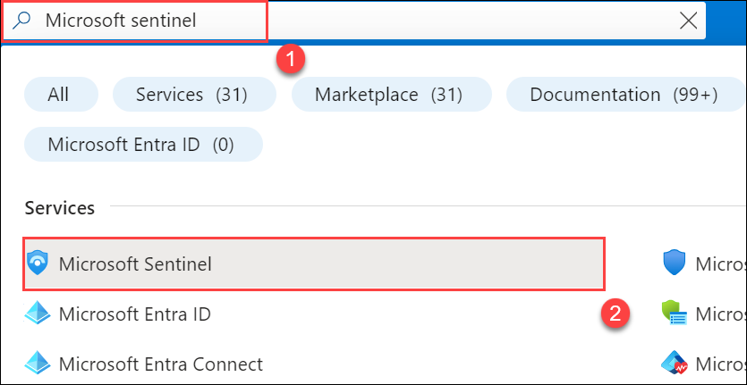
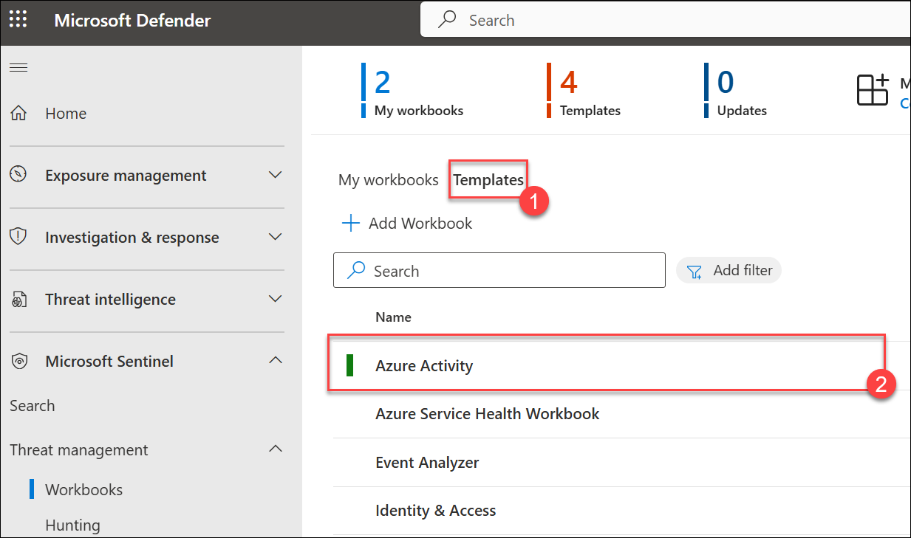
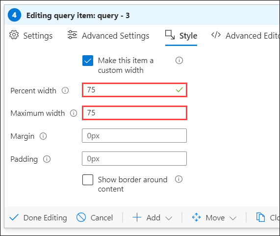

# Lab 01 - Configure Sentinel Workbooks and Detection Rules

## Exercise 1: Configure Sentinel Workbooks

## Lab Overview
Microsoft Sentinel allows you to create custom workbooks across your data and comes with built-in workbook templates to allow you to quickly gain insights across your data as soon as you connect a data source.

## Lab scenario
You are a Security Operations Analyst working at a company that implemented Microsoft Sentinel. Once you have connected your data sources to Microsoft Sentinel, you can visualize and monitor the data using the Microsoft Sentinel adoption of Azure Monitor Workbooks, which provides versatility in creating custom dashboards. 

## Lab objectives 
 In this lab, you will Understand the following:
 - Task 1: Create Sentinel Workspace
 - Task 2: Connect the Windows security event connector
 - Task 3: Save and modify a workbook template
 - Task 4: Create a Workbook

### Task 1: Create Sentinel Workspace

In this task, you will create a Microsoft Sentinel workspace where you will be monitoring and analyzing security events in upcoming labs.

1.  On Azure Portal page, in **Search resources, services and docs (G+/)** box at the top of the portal, enter **Microsoft Sentinel**, and then select **Microsoft Sentinel** under services.

    

1. From the Microsoft Sentinel page, select **+ Create**.

1. From Add Microsoft Sentinel to a workspace, select **+ Create a new workspace**.

1. From the basics tab of the Create Log Analytics workspace, enter the following and click **Review + Create**.   

    | Setting | Action |
    | -- | -- |
    | Subscription | Retain the default Subscription.  |
    | Resource group | select ResourceGroup(sentinel-rg). |
    | Name | Set the name to 'sentinelworkspace'. |
    | Region | Retain the default region. |
    |||

    

1. Verify the information you entered then select **Create**.

1. If you don’t see the new workspace listed, select **Refresh**, then select the newly created workspace **sentinelworkspace** and click on **Add**.

   

1. Once the new workspace is added, the Microsoft Sentinel | News & guides page will display, including that the Microsoft Sentinel free trial is activated. Select **OK**. Note the 
   three steps listed on the Get Started page.

   
   
   

> **Congratulations** on completing the task! Now, it's time to validate it. Here are the steps:.
> - Hit the Validate button for the corresponding task. If you receive a success message, you can proceed to the next task. 
> - If not, carefully read the error message and retry the step, following the instructions in the lab guide.
> - If you need any assistance, please contact us at cloudlabs-support@spektrasystems.com. We are available 24/7 to help you out.
   
<validation step="334fdf37-4cce-4af9-ac55-73608002b9e6" />

### Task 2: Connect the Windows security event connector

1. In the Search bar of the Azure portal, type **Microsoft Sentinel (1)**, then select **Microsoft Sentinel (2)**.

     

1. Select the Sentinel workspace which you have created in the previous task **sentinelworkspace**.

     

1. Navigate to the left menu and go to the Content Management section, select **Content Hub (1)**. On the Content Hub page, search and select **Windows Security Events (2)** and then **Select (3)** it. Finally, click on **Install (4)** and Follow the same steps to install **Azure Activity**.

    

      

1. After receiving the notification of a successful installation, return to the **Data Connector** page and click on the **Refresh** button to ensure that the changes take effect.

    

1. You should observe three options: **Security Events Via Legacy Agent**, **Windows Security Event Via AMA** and **Azure Activity**

1. Choose **Security Events Via Legacy Agent**, and then click on **Open connector page**.

     
   
1. In the configuration section, opt for **Install agent on Azure Windows Virtual Machine (1)**, and then choose **Download & Install agent for Azure Windows Virtual machines > (2)**.

     

1. Select the **svm-<inject key="DeploymentID" enableCopy="false" />** virtual machine and click on **Connect**.

     
        
1. Once **Connected (1)**, select the **Virtual Machines (2)** link from the top.

     

1. On the virtual machine page, select the **s2vm-<inject key="DeploymentID" enableCopy="false" />** virtual machine and click on **Connect**. Wait until get connected.

    

1. Then, come back to the configuration and scroll down a bit. You can find **Select which events to stream**. Click on **All Events**. Click on **Apply changes** now. If you refresh the data connector page, you can see the status Connected for **Security Events Via Legacy Agent**.

    

    

### Task 3: Save and modify a workbook template

In this task, you will save the Microsoft Sentinel workbook templates.

1. In the Search bar of the Azure portal, type *Microsoft Sentinel*, then select **Microsoft Sentinel**.

    

1. Select your Microsoft Sentinel Workspace.

    

1. Select **Workbooks (1)** under the *Threat Management* left blade, and select **Click here to go to the Defender portal (2)**. It will redirect you to the defender portal.

   

1. Select the **Templates (1)** tab, search and select the **Azure Activity (2)** template workbook.

   

1. Scroll down again and select the **Save** button for the *Azure Activity* workbook. 

1. Leave **East US** as the default value for *Region* and select **Yes**.

1. Select the **View saved workbook** button.

   

1. On the top select **Open in Azure**.

    

1. Select **Edit** in the command bar to enable changes in the workbook.

1. Scroll down to the **Caller activities** area, and look at the color of the *Activities* column since we are going to format those columns. Select the **Edit** button below the grid and select the **ellipsis (...) > +Add > Add query**.

   

   

1.  Type **SecurityEvent (1)** into the query box and click on **Run Query (2)** then select the **Column Settings (3)** button, which appears after clicking the **Run Query** button. 
    **Hint:**  This button only appears  if there  is data from the KQL query.

    
   
1. In the *Edit column settings* blade that appears, within *Columns* select **Activity(1)**.

1. Change the value for *Column renderer* to **Heatmap(2)**. For *Colour palette*, scroll down to select **32-color categorical(3)**.

1. Select **Save and Close(4)**. Notice the change in the *Activities* column.

   

1. Select **Done Editing** at the bottom of the query (not the top menu).

1. Now select **Done Editing** at the top menu and select the **Save** icon. 

1. Close the workbook by selecting the **X** in the top-right corner.

### Task 4: Create a Workbook

In this task, you will create a new workbook with advanced visualizations.

1. Navigate back to the **Microsoft Defender** portal, from the left navigation menu select **Workbooks (1)** and select **+ Add Workbook (2)** to create a new workbook from scratch.
 
    

    >**Note:** Although it is a new workbook, a startup template is used.

1. To edit the workbook, select **Edit**.

    

1. Select the **Edit** button below the new workbook overview of the workbook.

   

1. Type *# My workbook* in a new line on top of *## New workbook* and select **Done Editing** on the bottom of this section, *Editing text item: text - 2*. Notice that 
   your header increased in size and name changed.

    

1. Select **Edit** below the only visible bar chart graph.

    

1. Review the KQL statement that provides a *union* statement of counts across all tables.

1. Scroll down and select the **Done Editing** on the bottom menu, for the *Editing query item: query - 2*.

1. Select the ellipsis **...** next to the *Edit* button of the bar chart graph, then select **+ Add**, then select **Add query**.

    

1. Type **SecurityEvent** into the query box.

    
  
1. Change the *Time Range* to **Last hour(1)** and  *Visualization* to **Time chart(2)** and select the **Style(3)** tab from the query's command bar.

   

1. Select the **Make this item a custom width** box and set the *Percent width* to **25** and *Maximum width* to **25**.

    

1. Now select **Advanced Settings(1)** tab from the query's command bar and select **Show refresh icon when not editing(2)** box, scroll down and select **Done Editing(3)** on the bottom menu, 

    

1. Scroll down and at the bottom of the workbook select **+ Add**, then **Add query**.

    

1. Type **SecurityEvent** into the query box.

1. Change the *Time Range* to **Last hour (1)**.

1. Change the *Visualization* to **Grid (2)**.

   

1. Select **Style** from the query's command bar.

1. Select **Make this item a custom width** box.

1. Set the *Percent width* to **75** and *Maximum width* to **75**.

   

1. Scroll down and select **Done Editing** on the bottom menu, for the new *Editing query item: query - 3*.

1. Select **Done Editing** in Workbook's top command bar.

1. Select the **Save** icon, change the *Title* to **My Workbook** and Select **sentinel-rg** resource group, click on **Apply** to commit the changes. 
 
    

1. Close the workbook by selecting the **X** at the top-right or select **Workbooks** in the Microsoft Sentinel portal.

1. Back in the *Workbooks* page, select the **My workbooks** tab.

1. Select the workbook you just created, **My workbook**.

1. On the right pane, select **View saved workbook** to review your workbook.

     

### Conclusion
 Connecting data to Microsoft Sentinel enables you to monitor and visualize it using custom dashboards in Azure Monitor Workbooks, improving threat detection and response.

### Review
 In this lab, you will Understand following:
 - Saved and modify a workbook template
 - Created a Workbook

## Proceed to next Exercise