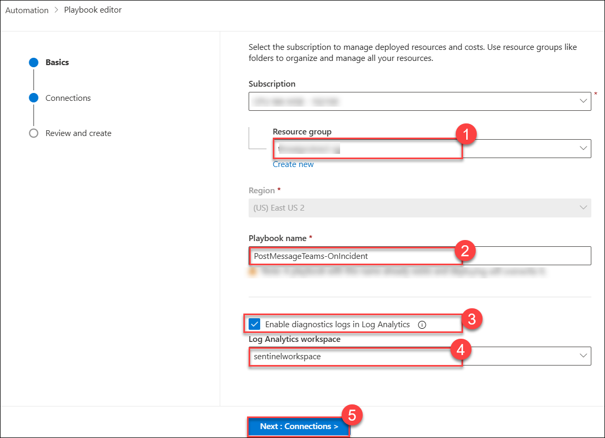
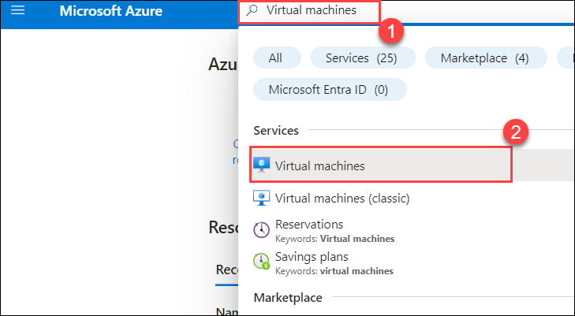
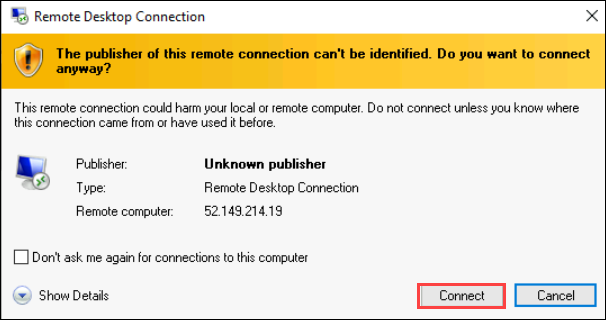

## Exercise 2: Configure Detection Rules

## Lab scenario

You are a Security Operations Analyst working at a company that implemented Microsoft Sentinel. You are going to work with Log Analytics KQL queries and from there, you will create custom analytics rules to help discover threats and anomalous behaviors in your environment.

Analytics rules search for specific events or sets of events across your environment, alert you when certain event thresholds or conditions are reached, generate incidents for your SOC to triage and investigate, and respond to threats with automated tracking and reMediation processes.

## Lab objectives
 In this lab, you will Understand following:

- Task 1: Playbook creation.
- Task 2: Persistence Attack Detection
- Task 3: Privilege Elevation Attack Detection

### Task 1: Playbook Creation.
In this task, you will create a playbook for next task.

1. In the Search bar of the Azure portal, type *Sentinel*, then select **Microsoft Sentinel**.

1. Select the Microsoft Sentinel Workspace you created earlier.

1. Select the **Automation (1)** from the *Configuration* section, and select **Click here to go to the Defender portal (2)**. It will redirect you to the Defender portal.

   

1. Click on **+ Create (1)** and select **Playbook with incident trigger (2)**.

    

1. Select the **sentinel-rg (1)** resource group and give playbook name **PostMessageTeams-OnIncident (2)**

1. Select **Enable diagnostics logs in Log Analytics (3)** and select your workspace which is **sentinelworkspace (4)**.

1. Click on **Next: Connections > (5)** then **Next: Review and Create**, and finally click on **Create Playbook** to continue to the designer.

    

### Task 2: Persistence Attack Detection

>**Important:** The next steps are done on a different machine than the one you were previously working on. Look for the Virtual Machine name references.

In this task, you will create a detection for the first attack of the previous exercise.

1. In the Search bar of the Azure portal, type *Sentinel*, then select **Microsoft Sentinel**.

1. Select the Microsoft Sentinel Workspace you created earlier.

1. Select **Logs** from the *General* section. Close the **Welcome to Log Analytics** and **Queries** tab.

1. We now know that the Threat Actor is using reg.exe to add keys to the Registry key and the program is located in C:\temp. **Run** the following statement to replace the *search* operator with the *where* operator in our query:

    ```KQL
    SecurityEvent 
    | where Activity startswith "4624" 
    ```
   

1. It is important to help the Security Operations Center Analyst by providing as much context about the alert as you can. This includes projecting Entities for use in the investigation graph. **Run** the following query:

    ```KQL
    SecurityEvent 
    | where Activity startswith "4624" 
    | extend timestamp = TimeGenerated, HostCustomEntity = Computer, AccountCustomEntity = SubjectUserName
    ```

1. Now that you have a good detection rule, in the Logs window, select the **+ New alert rule** in the command bar and then select **Create Microsoft Sentinel alert**. This will create a new Scheduled rule. **Hint:** You might need to select the ellipsis (...) button in the command bar.

   

1. This starts the "Analytics rule wizard". For the *General* tab type:

    |Setting|Value|
    |---|---|
    |Name|Startup RegKey|
    |Description|Startup RegKey in c:\temp|
    |MITRE ATT&CK|Persistence|
    |Severity|High|

1. Select **Next: Set rule logic >** button.

1. On the *Set rule logic* tab, the *Rule query* should be populated already with your KQL query, as well as the entities under *Alert enhancement** > **Entity mapping**. Select Entity mapping and choose **+ Add new entity** and use the settings in the table:

    |Entity|Identifier|Data Field|
    |:----|:----|:----|
    |Account|FullName|AccountCustomEntity|
    |Host|Hostname|HostCustomEntity|

    

1. For *Query scheduling* set the following:

    |Setting|Value|
    |---|---|
    |Run Query every|5 minutes|
    |Lookup data from the last|1 Days|

    >**Note:** We are purposely generating many incidents for the same data. This enables the Lab to use these alerts.

1. Leave the rest of the options with the defaults. Select **Next: Incident settings>** button.

    

1. On the *Automated response* tab under *Automation rules*, select **+ Add new**.

1. Use the settings in the table to configure the automation rule.

    |Setting|Value|
    |:----|:----|
    |Automation rule name|**Startup RegKey (1)**|
    |Trigger|**When incident is created (2)**|
    |Actions |**Run playbook (3)**|
    |Playbook |**PostMessageTeams-OnIncident (4)**|

   

    >**Note:** You need to assign permission to the playbook. Select **Manage playbook permissions** and from Manage permissions tab, select **sentinel-rg** resource group, select **Apply** button. Wait for 2-5 minutes and refresh page to get your playbook visible under actions option.

1. Select **Apply**

1. Select the **Next: Review + create >** button.
  
1. On the *Review and create* tab, select the **Save** button to create the new Scheduled Analytics rule.

### Task 3: Privilege Elevation Attack Detection

In this task, you will create a detection for the second attack of the previous exercise.

>**Important:** The next steps are done on a different machine than the one you were previously working on. Look for the Virtual Machine name references.

1. In Azure portal, Search for **Virtual machines (1)** and select **Virtual machines (2)**.

   

2. Select the virtual machine **s2vm-<inject key="DeploymentID" enableCopy="false" />** from the list.
   
   

3. At the beginning of the virtual machine page, click on **Connect (1)**, and from the drop-down select **Connect (2)**.

   

4. On the Connect to Virtual Machine page, from Native  RDP, Choose the option to **Download RDP File.** If under downloads tab, if prompted to choose Keep or delete. Choose **Keep**.

5. Open the downloaded RDP file from the downloads.

   

6. Select **Connect** when prompted. You will get a warning that the .rdp file is from an unknown publisher. This is expected. In the Remote Desktop Connection window, select Connect to continue.

   
   
7. In the Windows Security window, select More Choices and then Use a different account. Enter **Username:** <inject key="Labvm Admin Username"></inject> and **Password:** <inject key="Labvm Admin Password"></inject> and then select **OK**.

   

8. Select **Yes** to verify the identity of the virtual machine and finish logging on.

    

9. You should now be connected to the virtual machine via Remote Desktop.

10. In the search of the taskbar of your **s2vm-<inject key="DeploymentID" enableCopy="false" />** VM, enter *Command*. A Command Prompt will be displayed in the search results. Right-click on the Command Prompt and select **Run as Administrator**. Select **Yes** in the User Account Control window that allows the app to run.

11. In the Command Prompt, create a Temp folder in the root directory. Remember to press Enter after the last row:

    ```CommandPrompt
    cd \
    ```
    ```CommandPrompt
    mkdir temp
    ```
    ```CommandPrompt
    cd temp
    ```

    >**Note:** If you get result, Subdirectory or file temp already exists while running **mkdir temp** command then delete the temp file from C: path.

12. Copy and run this command to simulate the creation of an Admin account. Remember to press Enter after the last row:

    ```CommandPrompt
    net user theusernametoadd /add
    ```
    ```CommandPrompt
    net user theusernametoadd ThePassword1!
    ```
    ```CommandPrompt
    net localgroup administrators theusernametoadd /add
    ```

13. Minimize the **s2vm-<inject key="DeploymentID" enableCopy="false" />** VM. On the Lab-VM, in the Microsoft Sentinel portal, select **Logs** from the General section in case you navigated away from this page.

14. **Run** the following KQL Statement to identify any entry that refers to administrators:

    ```KQL
    search "administrators" 
    | summarize count() by $table
    ```

15. The result might show events from different tables, but in our case, we want to investigate the SecurityEvent table. The EventID and Event that we are looking is "4732 - A member was added to a security-enabled local group". With this, we will identify adding a member to a privileged group. **Run** the following KQL query to confirm:

    ```KQL
    SecurityEvent 
    | where EventID == 4732
    | where TargetAccount == "Builtin\\Administrators"
    ```

    

16. Expand the row to see all the columns related to the record. The username of the account added as Administrator does not show. The issue is that instead of storing the username, we have the Security IDentifier (SID). **Run** the following KQL to match the SID to the username that was added to the Administrators group:

    ```KQL
    SecurityEvent 
    | where EventID == 4732
    | where TargetAccount == "Builtin\\Administrators"
    | extend Acct = MemberSid, MachId = SourceComputerId  
    | join kind=leftouter (
        SecurityEvent 
        | summarize count() by TargetSid, SourceComputerId, TargetUserName 
        | project Acct1 = TargetSid, MachId1 = SourceComputerId, UserName1 = TargetUserName) on $left.MachId == $right.MachId1, $left.Acct == $right.Acct1
    ```

    

17. Extend the row to show the resulting columns, in the last one, we see the name of the added user under the *UserName1* column we *project* within the KQL query. It is important to help the Security Operations Analyst by providing as much context about the alert as you can. This includes projecting Entities for use in the investigation graph. **Run** the following query:

    ```KQL
    SecurityEvent 
    | where EventID == 4732
    | where TargetAccount == "Builtin\\Administrators"
    | extend Acct = MemberSid, MachId = SourceComputerId  
    | join kind=leftouter (
        SecurityEvent 
        | summarize count() by TargetSid, SourceComputerId, TargetUserName 
        | project Acct1 = TargetSid, MachId1 = SourceComputerId, UserName1 = TargetUserName) on $left.MachId == $right.MachId1, $left.Acct == $right.Acct1
    | extend timestamp = TimeGenerated, HostCustomEntity = Computer, AccountCustomEntity = UserName1
    ```

18. Now that you have a good detection rule, in the Logs window, select **+ New alert rule** in the command bar and then select **Create Microsoft Sentinel alert**. **Hint:** You might need to select the ellipsis (...) button in the command bar.

19. This starts the "Analytics rule wizard". For the *General* tab type:

    |Setting|Value|
    |---|---|
    |Name|**SecurityEvent Local Administrators User Add (1)**|
    |Description|**User added to Local Administrators group (2)**|
    |Severity|**High (3)**|
    |MITRE ATT&CK|**Privilege Escalation (4)**|

    

20. Select **Next: Set rule logic (5) >** button. 

21. On the *Set rule logic* tab, the *Rule query* should be populated already with your KQL query, as well the entities under **Alert enhancement** > **Entity mapping**.

22. For **Query scheduling** set the following:

    |Setting|Value|
    |---|---|
    |Run Query every|5 minutes|
    |Lookup data from the last|1 Days|

    >**Note:** We are purposely generating many incidents for the same data. This enables the Lab to use these alerts.

23. Leave the rest of the options with the defaults. Select **Next: Incident settings >** button.

24. For the *Incident settings* tab, leave the default values and select **Next: Automated response >** button.

25. On the **Automated response** tab under **Automation rules**, select **+ Add new**.

26. Use the settings in the table to configure the automation rule.

    |Setting|Value|
    |:----|:----|
    |Automation rule name|SecurityEvent Local Administrators User Add|
    |Trigger|When incident is created|
    |Actions |Run playbook|
    |Playbook |PostMessageTeams-OnIncident|

    >**Note:** You have already assigned permissions to the playbook, so it will be available.

27. Select **Apply**

28. Select the **Next: Review + create >** button.
  
29. On the *Review and create* tab, select the **Save** button to create the new Scheduled Analytics rule.

## Conclusion

 using Microsoft Sentinel and KQL queries allows you to create analytics rules that detect threats, streamline incident response, and automate remediation, helping to keep your 
 organization's environment secure.

## Review
In this lab, you have completed the following:
- Persistence Attack Detection
- Privilege Elevation Attack Detection